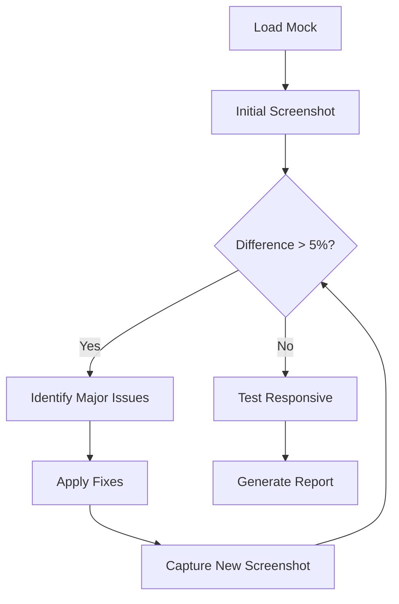

# Visual Development Iteration Patterns

**Created**: 2025-01-24
**Category**: Visual Development
**Success Rate**: High

## Pattern: Progressive Refinement

### Description
Start with major layout adjustments, then refine details progressively.

### Implementation
```javascript
// Iteration 1: Major layout
await playwright_evaluate(`
  document.querySelector('.container').style.maxWidth = '1200px';
  document.querySelector('.container').style.margin = '0 auto';
`);

// Iteration 2: Spacing adjustments
await playwright_evaluate(`
  document.querySelector('.header').style.padding = '24px';
  document.querySelector('.content').style.gap = '16px';
`);

// Iteration 3: Fine details
await playwright_evaluate(`
  document.querySelector('.button').style.borderRadius = '6px';
  document.querySelector('.text').style.lineHeight = '1.6';
`);
```

### Success Metrics
- Typically achieves < 5% difference in 2-3 iterations
- Most effective for component-level refinement

## Pattern: Viewport-First Development

### Description
Perfect desktop view first, then adapt for responsive viewports.

### Implementation
1. Desktop (1920x1080): Achieve < 5% difference
2. Tablet (768x1024): Adjust with media queries
3. Mobile (375x667): Final responsive tweaks

### CSS Injection for Responsive
```javascript
await playwright_evaluate(`
  const style = document.createElement('style');
  style.textContent = \`
    @media (max-width: 768px) {
      .container { padding: 12px; }
      .header { font-size: 24px; }
    }
    @media (max-width: 480px) {
      .container { padding: 8px; }
      .header { font-size: 20px; }
    }
  \`;
  document.head.appendChild(style);
`);
```

## Pattern: State-Based Iteration

### Description
Iterate through component states systematically.

### States to Test
1. Default/Rest state
2. Hover state
3. Active/Pressed state
4. Disabled state
5. Loading state
6. Error state

### Implementation
```javascript
// Capture each state
const states = ['default', 'hover', 'active', 'disabled'];
for (const state of states) {
  // Trigger state
  if (state === 'hover') {
    await playwright_hover('.button', buttonRef);
  } else if (state === 'active') {
    await playwright_click('.button', buttonRef);
  }
  // Capture and compare
  await playwright_screenshot(null, `button-${state}.png`);
}
```

## Pattern: Color Precision

### Description
Achieve exact color matching through systematic adjustment.

### Common Adjustments
```javascript
// Extract exact colors from mock
const colors = {
  primary: '#007bff',
  secondary: '#6c757d',
  background: '#f8f9fa',
  text: '#212529'
};

// Apply precisely
await playwright_evaluate(`
  document.documentElement.style.setProperty('--primary', '${colors.primary}');
  document.documentElement.style.setProperty('--text', '${colors.text}');
`);
```

## Pattern: Typography Alignment

### Description
Match font properties systematically.

### Properties to Adjust
1. font-family
2. font-size
3. font-weight
4. line-height
5. letter-spacing

### Implementation
```javascript
await playwright_evaluate(`
  const heading = document.querySelector('h1');
  heading.style.fontFamily = '-apple-system, BlinkMacSystemFont, "Segoe UI", Roboto';
  heading.style.fontSize = '32px';
  heading.style.fontWeight = '600';
  heading.style.lineHeight = '1.2';
  heading.style.letterSpacing = '-0.02em';
`);
```

## Pattern: Shadow and Border Refinement

### Description
Fine-tune shadows and borders for pixel-perfect match.

### Common Patterns
```javascript
// Box shadows
await playwright_evaluate(`
  document.querySelector('.card').style.boxShadow = '0 2px 4px rgba(0,0,0,0.1)';
  document.querySelector('.card').style.boxShadow = '0 4px 6px -1px rgba(0,0,0,0.1), 0 2px 4px -1px rgba(0,0,0,0.06)'; // Tailwind-style
`);

// Borders
await playwright_evaluate(`
  document.querySelector('.input').style.border = '1px solid #d1d5db';
  document.querySelector('.input').style.borderRadius = '6px';
`);
```

## Anti-Patterns to Avoid

### ❌ Random Adjustments
Don't make random CSS changes hoping to improve match.

### ❌ Ignoring Viewport Differences
Always ensure mock and implementation use same viewport.

### ❌ Over-Iteration
If > 5 iterations without improvement, reassess approach.

### ❌ Pixel-Level Tweaking Too Early
Fix major layout issues before fine-tuning pixels.

## Success Strategies

### Quick Wins
1. Match viewport dimensions exactly
2. Ensure fonts are loaded before screenshot
3. Disable animations during capture
4. Use exact color values from design

### Debugging Tips
1. Save diff images to identify problem areas
2. Use browser DevTools alongside MCP
3. Compare computed styles between mock and implementation
4. Check for CSS conflicts or overrides

## Recommended Iteration Flow



## Metrics

- **Average iterations to success**: 2-3
- **Success rate with proper mocks**: 95%
- **Most common issues**: Spacing (40%), Colors (30%), Typography (20%), Shadows (10%)
- **Time per component**: 5-10 minutes

## Tools Integration

### With Playwright MCP
- All patterns use playwright_evaluate for CSS injection
- playwright_screenshot for capturing iterations
- playwright_set_viewport for responsive testing

### With Visual Compare Utility
- Automatic diff generation
- Percentage calculation
- Report generation

## Related Patterns
- [Mock Preparation Best Practices](./mock-preparation.md)
- [Responsive Testing Strategies](./responsive-testing.md)
- [CSS Injection Techniques](./css-injection.md)